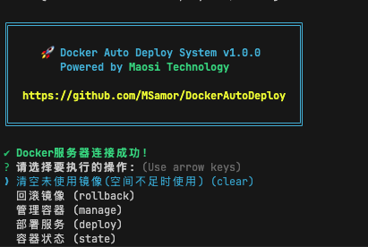

# 🐳 Docker Auto Deploy

一个强大的 Docker 容器管理工具，提供直观的命令行界面，帮助您轻松管理 Docker 容器的部署、回滚和监控。

🔗 **项目地址**: [https://github.com/MSamor/DockerAutoDeploy](https://github.com/MSamor/DockerAutoDeploy)

## ✨ 特性

- 🚀 **快速部署** - 轻松部署 Docker 容器，支持公共和私有镜像
- 🔄 **版本回滚** - 一键回滚到之前的版本
- 🎯 **状态监控** - 实时查看容器运行状态
- 🛠️ **容器管理** - 便捷的容器启动、停止和删除操作
- 🧹 **空间清理** - 自动清理未使用的镜像，释放磁盘空间
- 📝 **配置灵活** - 支持自定义配置文件，方便管理多个部署环境
- 📂 **目录挂载** - 支持容器目录挂载，方便数据持久化和配置管理

## 📦 安装

```bash
npm install -g docker-auto-deploy
```

## ⚙️ 配置

使用以下命令生成默认配置文件：

```bash
maosi init
```

这将在当前目录下创建 `config.json` 文件。配置文件结构如下：

```json
{
  "public": [
    {
      "name": "示例公共镜像",        // 应用名称
      "imageName": "nginx",         // 镜像名称
      "serveraddress": "docker.m.daocloud.io",  // 镜像仓库地址
      "hostPort": 80,  // 可选，
      "containerPort": 80,  // 可选，
      "hostVolume": "/path/to/host/dir",     // 可选，主机挂载目录
      "containerVolume": "/path/to/container" // 可选，容器挂载目录
    }
  ],
  "private": [                      // 私有镜像配置（可选）
    {
      "name": "示例私有镜像",
      "imageName": "nginx",
      "username": "your-username",   // 私有仓库用户名
      "password": "your-password",   // 私有仓库密码
      "auth": "token",              // 认证令牌
      "email": "your@email.com",    // 邮箱
      "serveraddress": "index.docker.io/v1",  // 私有仓库地址
      "hostPort": 80,               // 主机端口（可选）
      "containerPort": 80,          // 容器端口（可选）
      "hostVolume": "/path/to/host/private",      // 主机挂载目录（可选）
      "containerVolume": "/path/to/container/private"  // 容器挂载目录（可选）
    }
  ],
  "host": "127.0.0.1",             // Docker守护进程主机地址
  "port": "2375"                   // Docker守护进程端口
}
```

### 配置说明

- `public`: 公共镜像配置数组（必需）
  - `name`: 应用名称
  - `imageName`: 镜像名称
  - `serveraddress`: 镜像仓库地址
  - `hostPort`: 主机端口（可选）
  - `containerPort`: 容器端口（可选）
  - `hostVolume`: 主机挂载目录（可选）
  - `containerVolume`: 容器挂载目录（可选）

- `private`: 私有镜像配置数组（可选）
  - 包含所有公共镜像配置项
  - `username`: 私有仓库用户名（必需）
  - `password`: 私有仓库密码（必需）
  - `auth`: 认证令牌（必需）
  - `email`: 邮箱地址（必需）

- `host`: Docker守护进程主机地址
- `port`: Docker守护进程端口

## 🚀 使用指南

### 基本命令

```bash
# 启动工具
maosi
```

### 图片示例



### 功能菜单

- **🚢 部署服务**
  - 选择并部署 Docker 容器
  - 自动拉取最新镜像
  - 配置端口映射（可选）
  - 配置目录挂载（可选）

- **🔄 回滚镜像**
  - 查看可用版本
  - 选择目标版本
  - 执行回滚操作

- **🛠️ 管理容器**
  - 启动容器
  - 停止容器
  - 删除容器（带确认提示）

- **📊 容器状态**
  - 查看所有容器状态
  - 显示运行时间
  - 端口映射信息

- **🧹 清理空间**
  - 清理未使用的镜像
  - 释放磁盘空间

## 💡 使用流程示例

1. **部署新服务**
   ```
   选择操作 > 部署服务
   选择配置 > 选择镜像
   确认端口（可选）> 确认挂载目录（可选）> 执行部署
   ```

2. **管理现有容器**
   ```
   选择操作 > 管理容器
   选择动作 > 启动/停止/删除
   选择容器 > 确认操作
   ```

3. **版本回滚**
   ```
   选择操作 > 回滚镜像
   选择容器 > 选择版本
   确认回滚 > 执行回滚
   ```

## 🤝 贡献

欢迎提交问题和改进建议！

1. Fork 本项目
2. 创建您的特性分支
3. 提交您的改动
4. 推送到您的分支
5. 创建 Pull Request

## 📄 许可证

本项目采用 MIT 许可证 - 查看 [LICENSE](LICENSE) 文件了解详细信息。

## 🔗 相关链接

- [问题反馈](https://github.com/MSamor/DockerAutoDeploy/issues)
- [更新日志](CHANGELOG.md)